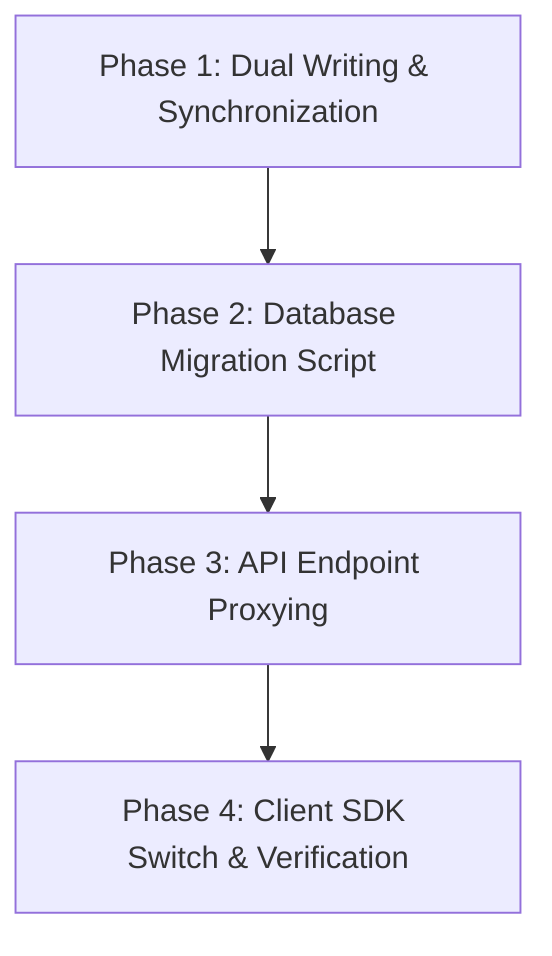

# HabitFlow — Production Backend Upgrade & Architecture Plan

> **Document Version**: 2.0.0  
> **Author**: Lead Architecture & Engineering Team  
> **Status**: Production Blueprint  

---

## 1. Executive Summary

HabitFlow is a production-level habit tracking platform designed for high performance, personal productivity tracking, analytical reporting, and seamless habit consistency.

This document outlines the architectural upgrade path from the current **Node.js + Express + MySQL** stack to modern alternatives, specifically evaluating:
1. **Node.js + Express + MongoDB (MERN Stack)**
2. **Firebase Backend-as-a-Service (FaaS)**

---

## 2. Technical Evaluation Matrix

| Metric / Dimension | Current: Node.js + Express + MySQL | Proposed Option A: Node.js + Express + MongoDB | Proposed Option B: Firebase Platform |
| :--- | :--- | :--- | :--- |
| **Data Structure** | Relational Tables & SQL Views | Flexible Document JSON Collections | NoSQL Document Hierarchy (Firestore) |
| **ACID Transactions** | Fully compliant with Foreign Keys | Multi-document transactions supported | Batched writes & transactions supported |
| **Real-time Updates** | Polling or WebSocket integration | Change Streams or Socket.io integration | Native Firestore Realtime Listeners |
| **Authentication** | Custom JWT + bcryptjs | Custom JWT + Passport.js / OAuth | Firebase Auth (Google, Email, Social) |
| **Offline Sync** | Client LocalStorage / IndexedDB | Client LocalStorage / PWA Service Worker | Native Firestore Offline Cache |
| **Hosting & Scalability**| AWS EC2 / DigitalOcean / RDS | MongoDB Atlas + Cloud Run | Serverless (Firebase Cloud Functions) |
| **Developer Velocity**| High (Structured & Explicit SQL) | High (JavaScript end-to-end) | Extremely High (Serverless SDKs) |
| **Monthly Operating Cost**| Fixed VM/RDS Cost ($15–$50/mo) | Flexible Atlas ($0–$60/mo) | Pay-per-read/write (Free tier available) |

---

## 3. Data Schema & Model Mapping Comparison

### 3.1 Existing MySQL Relational Schema
```sql
users (id, username, email, password_hash, display_name)
  │
  ├── user_settings (id, user_id, theme, accent_color, reminder_time)
  ├── habits (id, user_id, category_id, name, current_streak, longest_streak)
  │     └── habit_logs (id, habit_id, user_id, log_date, completed)
  ├── reminders (id, user_id, habit_id, reminder_time, is_enabled)
  ├── achievements (id, user_id, badge_id, badge_title, earned_at)
  └── export_history (id, user_id, export_type, file_name, exported_at)
```

### 3.2 MongoDB Document Schema Design
In MongoDB, we embed habit logs or keep them in time-series sub-collections for maximum query speed:

```json
// Collection: users
{
  "_id": "ObjectId('65a123...')",
  "username": "ravi_patel",
  "email": "ravi@example.com",
  "passwordHash": "$2b$12...",
  "settings": {
    "theme": "dark",
    "accentColor": "purple",
    "fontSize": "medium",
    "notificationsEnabled": true,
    "reminderTime": "08:00:00",
    "streakAlerts": true
  },
  "achievements": [
    { "badgeId": "first_habit", "earnedAt": "2026-09-10T10:00:00Z" }
  ],
  "createdAt": "2026-09-10T10:00:00Z"
}

// Collection: habits
{
  "_id": "ObjectId('65a999...')",
  "userId": "ObjectId('65a123...')",
  "name": "Drink 8 Glasses of Water",
  "category": "health",
  "iconEmoji": "💧",
  "colorHex": "#ef4444",
  "frequency": "daily",
  "startDate": "2026-08-01",
  "streaks": {
    "current": 7,
    "longest": 14
  },
  "totalCompletions": 24,
  "missedDays": 6,
  "completedDates": [ "2026-09-08", "2026-09-09", "2026-09-10" ],
  "isArchived": false,
  "createdAt": "2026-08-01T08:00:00Z"
}
```

### 3.3 Firebase Firestore Hierarchy
```
users/ (Collection)
  └─ {userId} (Document)
       ├─ profile: { displayName, email, photoURL }
       ├─ settings: { theme, accentColor, reminderTime }
       └─ habits/ (Sub-collection)
            └─ {habitId} (Document)
                 ├─ name: "Morning Run"
                 ├─ streak: 5
                 └─ logs/ (Sub-collection)
                      └─ {YYYY-MM-DD} (Document)
```

---

## 4. Authentication Transition Strategy

### Option A: Node.js + Express (JWT + Refresh Tokens)
- **AccessToken**: Short-lived (15 minutes), stored in memory or HttpOnly Cookie.
- **RefreshToken**: Long-lived (7 days), stored in secure HttpOnly Cookie with database whitelist / revocation.

### Option B: Firebase Authentication Integration
- Replace custom auth controllers with Firebase Web SDK:
  ```javascript
  import { getAuth, signInWithEmailAndPassword, onAuthStateChanged } from "firebase/auth";
  
  const auth = getAuth();
  signInWithEmailAndPassword(auth, email, password)
    .then((userCredential) => {
      const token = await userCredential.user.getIdToken();
      // Token passed to backend for verification via firebase-admin SDK
    });
  ```

---

## 5. Migration Execution Roadmap



### Phase 1: Preparation & Dual Schemas
- Create automated migration script (`scripts/migrate-mysql-to-mongo.js` or `scripts/migrate-mysql-to-firebase.js`).
- Add database fallback flags in backend environment config (`STORAGE_DRIVER=mysql|mongodb|firebase`).

### Phase 2: Data Transfer Validation
- Export existing MySQL tables (`users`, `user_settings`, `habits`, `habit_logs`, `reminders`, `export_history`) to intermediate JSON objects.
- Validate record count and constraint integrity.

### Phase 3: Deployment & Load Testing
- Deploy Express API on containerized environment (Docker / AWS ECS / Google Cloud Run).
- Perform load tests ensuring latency stays below 50ms for habit logging requests.

---

## 6. Recommendations & Final Verdict

1. **For Enterprise & Multi-User Analytics**: Keep **Node.js + Express + MySQL**. The SQL relational model with pre-compiled SQL views (`vw_analytics_weekly`, `vw_best_habit`) yields superior sub-millisecond query reporting.
2. **For Rapid Mobile & Offline Sync**: Transition to **Firebase (Firestore + Auth)** to gain native offline caching, push notifications (FCM), and zero server management overhead.
